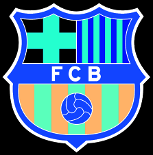

# IMAGE PROCESSING ASSIGNMENT

### Problem Statement

- Write a class which has implementation of at least 5 image processing operations, pass an image to these operations and infer it.
- Should not use openCV lib for image processing operations(except for reading and writing images).

<hr>

### Outputs

| Input                  | Grayscaled                             | Rotated                              | Color Inverted                              | Scaled                              | Thresholded                              |
| ---------------------- | -------------------------------------- | ------------------------------------ | ------------------------------------------- | ----------------------------------- | ---------------------------------------- |
|  |  |  |  |  |  |

<hr>

### Solution

- The project needs to be build using **_CMake_** in order to support OpenCV library used for read-write operations only.
- The output images and `.exe` files are stored in `Output` directory.
- [Sample Output](logs.txt)
- To build and run:

```shell
# Generate Build Files
mkdir build
cd build
cmake ..

# Build
cmake --build .

# Run the program
Output/Debug/Image_Preprocessing_Assignment.exe
```

<hr>
