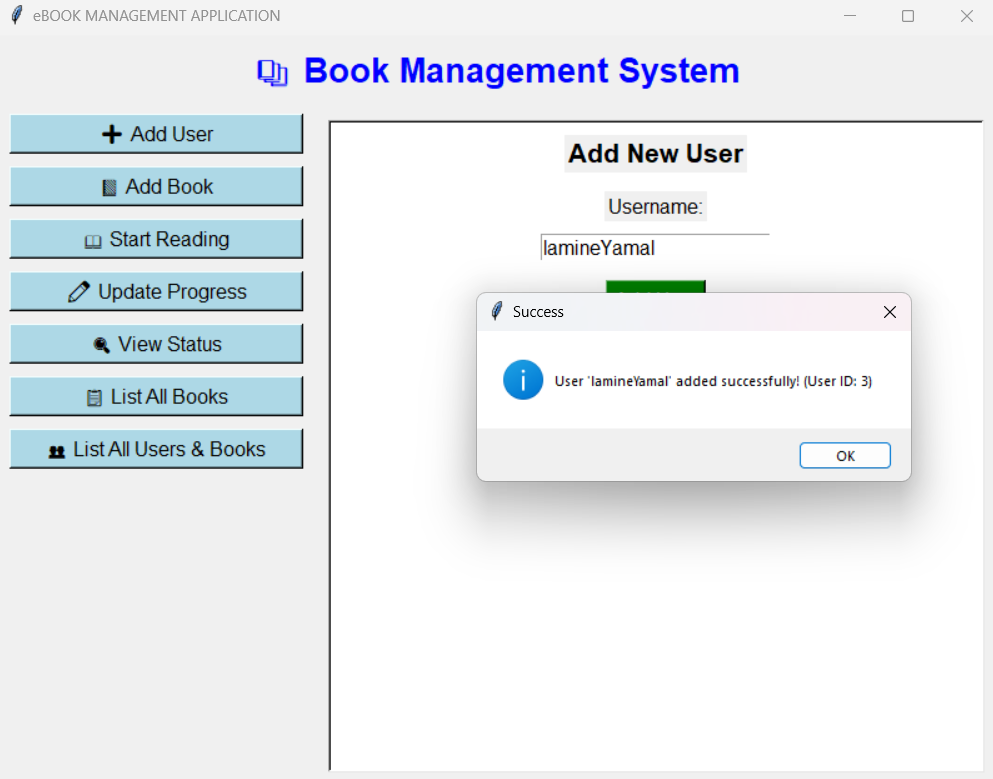
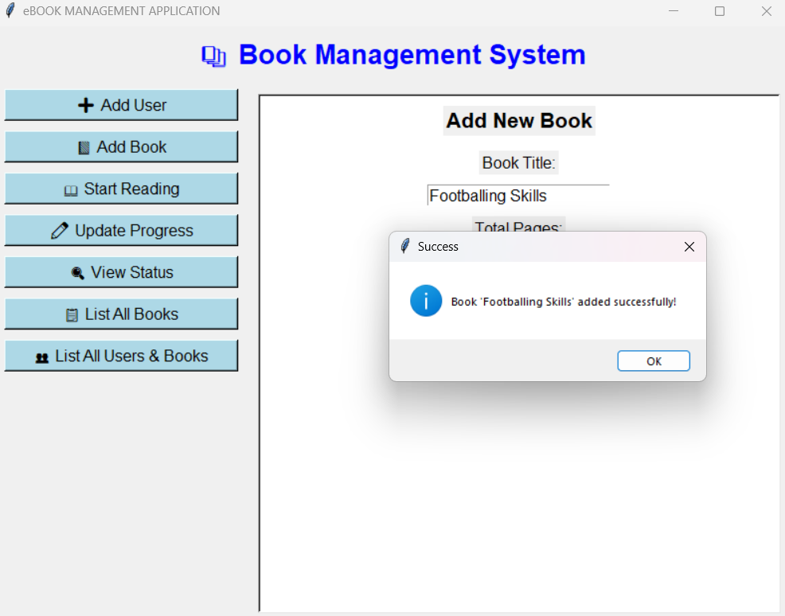
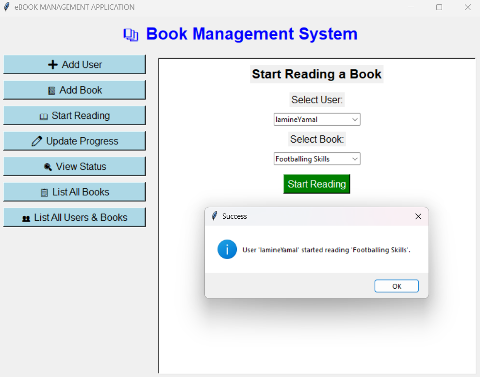
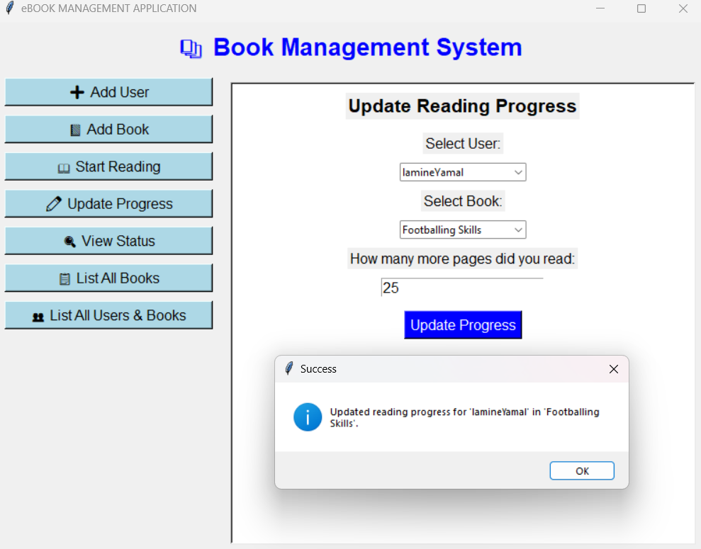
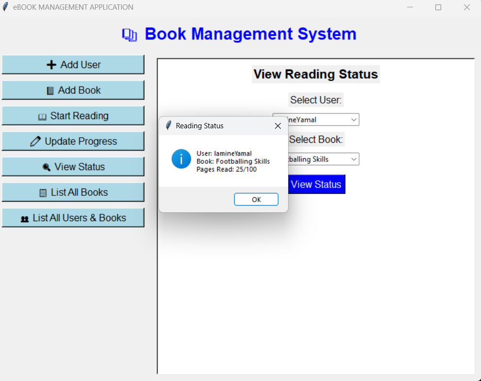
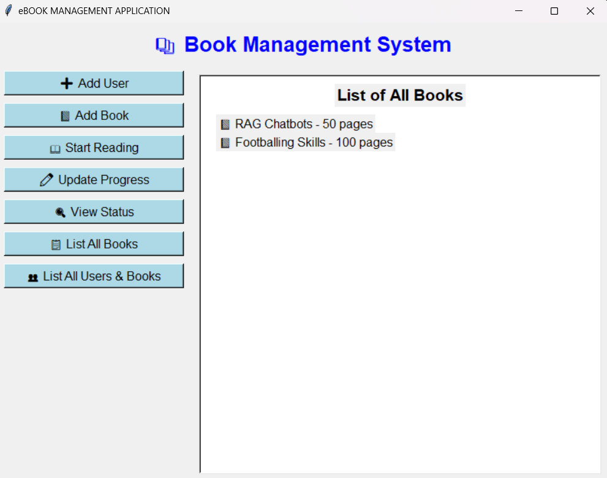
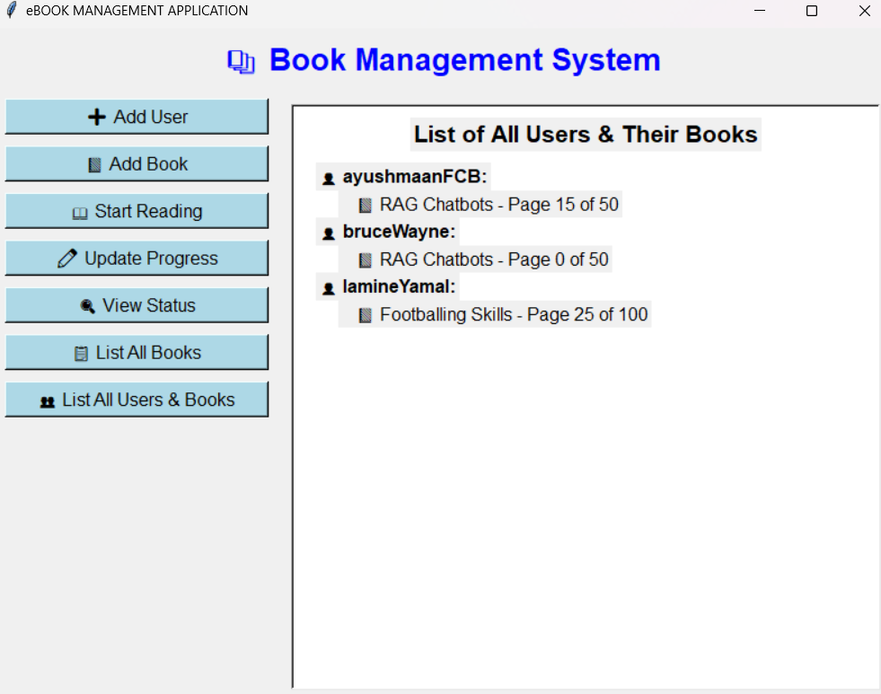

# eBOOK APPLICATION ASSIGNMENT

### Problem Statement

- Create a Book Class with attributes like Page Number, Username who is reading, Current Page Number, Topic, etc.
- Information needs to be updated depending on the user, if the new user reads, his topic, page number, etc. should be stored.
- Also, information should be retained even after shutting the program. Maintain a storage sort of thing.
- Text File, CSV, SQL-Lite 3 (chose any for data storage).

### About the Application

- In order to run the application:
  - **Tkinter GUI:** `python gui.py`
  - **Simple CLI Application:** `python app.py`
- Technologies used: **_sqlite3_**, **_tkinter_**

### Snapshots of the Application created

  

    
    
<em>New Reader</em>

  

  

    
    
<em>New Book</em>

  

  

    
    
<em>Start Reading</em>

  

  

    
    
<em>Update Read Pages</em>

  

  

    
    
<em>Reading Status</em>

  

  

    
    
<em>All Books</em>

  

  

    
    
<em>All Registered Readers</em>

  

