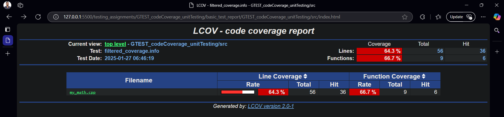
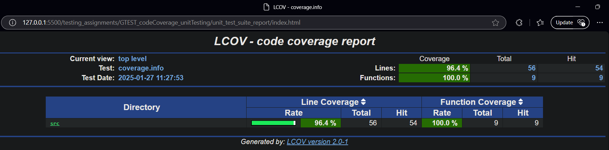
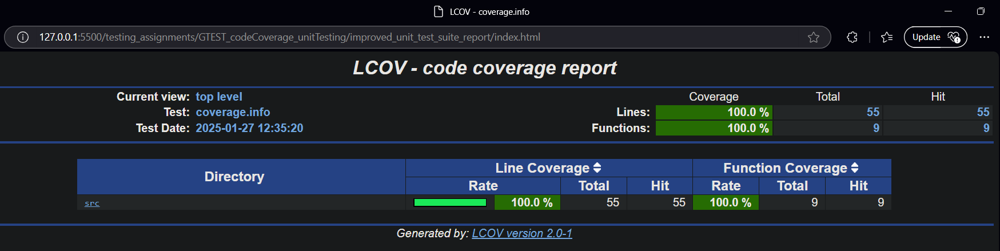

# Code Coverage Analysis and Unit Testing Enhancement

### Problem Statement

1. Perform code coverage analysis on the above MATH_LIB application.

2. Integrate Google Test (GTEST) and enhance code coverage. Aim for 100% code coverage.

This exercise is to enhance the robustness and reliability of the applications by improving test coverage and implementing extensive unit tests.

Required Actions:

- Code Coverage Analysis
- Implement unit test-suite
- Code Coverage Improvement
- Validation and Reporting

### Results

|                       | Basic Testing | Unit Testing Suite | Improved Unit Testing Suite |
| --------------------- | ------------- | ------------------ | --------------------------- |
| **Line Coverage**     | 64.3%         | 96.4%              | 100%                        |
| **Function Coverage** | 66.7%         | 100%               | 100%                        |

- Proofs:
  - 
  - 
  - 

### Files and Solution

- Test scripts are located in [test_coverage](./test_coverage/) folder:
  - [Unit Test Suite](./test_coverage/test_my_math.cpp)
  - [Improved Tests with 100% Code Coverage](./test_coverage/improved_test_my_math.cpp)
- The detailed report can be viewed through HTML files:
  - [Simple Initial Tests](./basic_test_report/index.html)
  - [Unit Test Suite](./unit_test_suite_report/index.html)
  - [Improved suite (100% Coverage)](./improved_unit_test_suite_report/index.html)
- The detailed logs can be viewed in the [logs](./logs/) directory.

