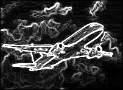

# Image Preprocessing Technique

### About

This program applies image preprocessing techniques to the src image using cpp.

- 1. Grayscale Conversion
- 2. Rotation by angle
- 3. Vertical Flip
- 4. Zoom In
- 5. Sobel Edge detection

OpenCV Library is used to open and display the original and resultant images.

### Run the program

##### Create build directory

```
mkdir build
cd build
```

##### Build and Run

```
cmake ..
cmake --build .
./ImagePreprocessing.exe

```

### Output

```
Enter the angle (in degrees) to rotate the image: 60  

```


