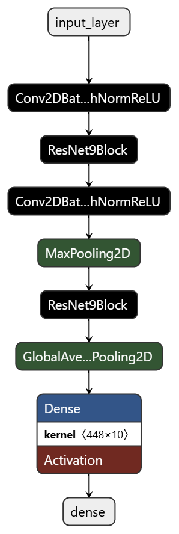

# CIFAR10-IMAGE-CLASSIFICATION

### About

ResNet 9 model structure is applied for cifar 10 image classification.

- 1. Conv2DBatchNormRELU layer : Combines convolution, batch normalization, and ReLU activation to enhance feature extraction with L2 regularization.

- 2. ResNet9 Block : A residual block with two convolutional layers, a shortcut connection, and max-pooling.

- 3. Model Arch. : Alternating convolutional and residual blocks for feature extraction and dense layer with softmax for classification.

- 4. Hyperparameter Tuning : keras tuner used for finding best parameters

    ###### Best hyperparameters:
    - Filters 1         : 128
    - Filters 2         : 64
    - Filters 3         : 448
    - Filters 4         : 448
    - L2 Regularization : 0.0001
    - Learning Rate     : 0.001

- 5. Data Augmentation

| Rotation range | Horizontal flip | Width shift range | Height shift range |
|---|--|--|-|
|15|True|0.1|0.1|

### Model Performance

|Approach| Metric    | Training | Validation | Testing |
|--------|-----------|----------|---------|------------|
|RESNET9 Model Structure| Accuracy  | 92.74%   | 82.00%     | 81.36% |
|RESNET9 Model with Hyperparameter Tuning | 93.68% | 82.18% | 82.49% | 
|Tuned RESNET9 Model with Augmentation | 98.34% | 91.04% | 90.00% |

### Time Inference

| Runtime Env | Time taken to process single image |
|-|-|
| CPU | 0.155948 s |
| GPU | 0.099288 s |
| TensorRT | 0.000419 s |