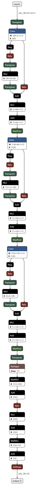

# Load and Run model using TVM

### Install from source

##### Install Pre-requisite

```
sudo apt-get update
sudo apt-get install llvm clang
sudo apt install cmake
```

##### Clone TVM repo

```
git clone --recursive https://github.com/apache/tvm.git
```

##### Build TVM

```
mkdir build
cd build
cmake .. -DUSE_LLVM=ON -DCMAKE_BUILD_TYPE=Release
make -j$(nproc)
```

##### Create Virtual Env and install library

```
sudo apt install python3-pip

sudo apt install python3-venv
python3 -m venv tvm-venv
source tvm-venv/bin/activate

pip install numpy
pip install decorator
pip install psutil
pip install typing-extensions
pip install attrs
pip install onnx
pip install opencv-python
pip install pillow

```

### Model Arch



### Model output

```
ONNX model loaded successfully.
ONNX model successfully converted to Relay IR.
Model inputs:
Name: inputs, Shape: dim {
  dim_param: "unk__94"
}
dim {
  dim_value: 32
}
dim {
  dim_value: 32
}
dim {
  dim_value: 3
}

Input name: inputs, Input shape set to (1, 32, 32, 3)

Applying custom optimization passes...

Optimized Relay IR saved to 'optimized_relay_model.txt'.

Compiling the optimized model...
One or more operators have not been tuned. Please tune your model for better performance. Use DEBUG logging level to see more details.
Model successfully compiled.

Model inference result:
[[2.0101024e-03 1.3192629e-03 8.5637359e-05 8.4422391e-05 1.5676767e-05
  1.1075239e-04 7.7918509e-04 3.1912909e-03 9.8998815e-01 2.4155565e-03]]
Predicted class: ship
```